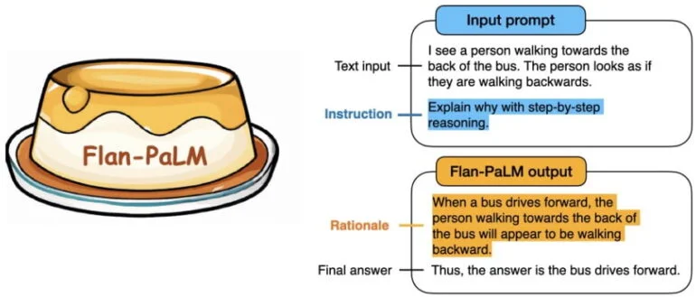

# What is Flan T5?

**FLAN-T5 is an open source text generation model developed by Google AI**. What is cool about Flan-T5 is how it was trained. In 2019, Google published a paper "[Exploring the Limits of Transfer Learning with a Unified Text-to-Text Transformer](https://ai.googleblog.com/2020/02/exploring-transfer-learning-with-t5.html)",and released the T5 architecture the same year GPT2 was released. 

However, instead of training a totally new model, in a [follow-up paper in 2022](https://arxiv.org/abs/2210.11416) they took this model and finetuned it on specific tasks. 

Finetuning is essentially training the model further on additional data to have it learn from it. When finetuning you need:

* **An original data source** (e.g. the Reddit Explain Like I'm Five subreddit).
* **A Task** (e.g. question answering)

Flan-T5 is the result of T5 being finetuned on 473 datasets across 146 different task categories. 

As you can imagine performance across all of these tasks drastically improved and the largest Flan-T5 model outperforms GPT3 in some cases.

Right now Flan-T5 is almost the go to for finetuning an LLM on your own task because it's open source so it's free (if you're using your own machine) and you don't need to share your data with anyone because you can do it yourself.  

One thing to note, because this model was 'instruction fine tuned' it is used to receiving input as an instruction and performance can be subpar otherwise. 

